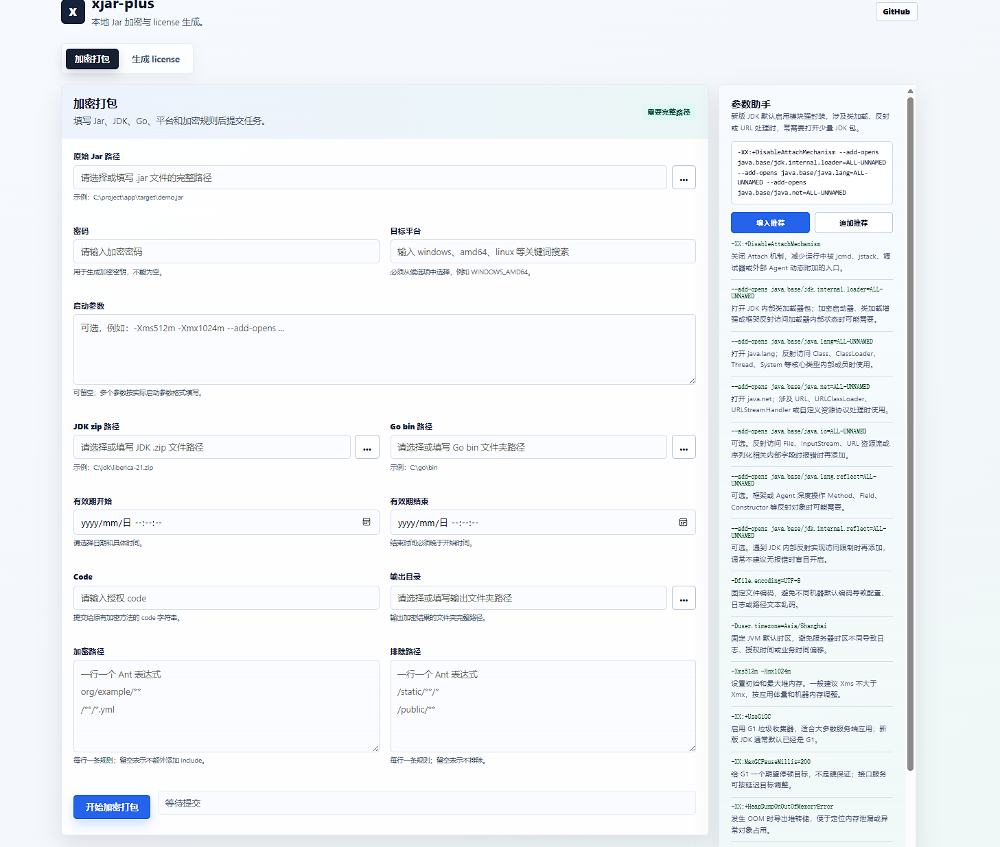
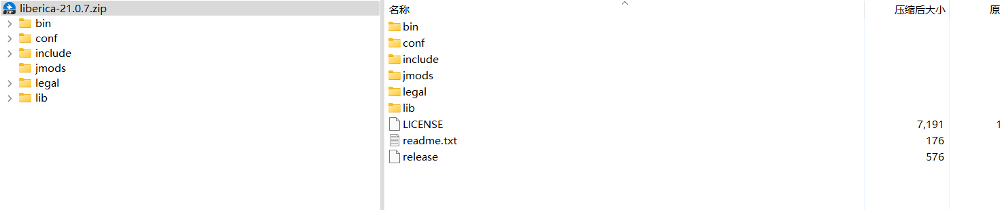

# xjar-plus 新手指南

xjar-plus 是基于 xjar 修改的 Jar 加密和启动器打包工具，当前项目主要适配 Spring Boot 3.4.2 + JDK 21。它可以把原始 Jar
中指定路径的 class 或资源加密，并生成一个 Go 编译的启动器。目标机器运行时不需要安装 Go，只需要运行打包后的启动器。

项目同时提供本地 Web UI，适合不想直接改 Java 测试代码的新手用户通过表单完成加密打包和 license 生成。

## 适合解决什么问题

- 不希望直接分发可反编译的明文 Jar。
- 希望只加密业务包、配置文件等指定资源，而不是把整个 Jar 都处理掉。
- 希望随启动器一起携带指定版本的 JDK。
- 希望限制启动器有效期，并可通过 license 文件调整启动参数和有效期。
- 希望通过可视化界面填写 Jar、JDK、Go、平台、有效期、输出目录等参数，降低首次使用成本。

## 环境准备

构建机器需要准备：

1. JDK 21。
2. Maven。
3. Go 环境，用于编译启动器。
4. 需要被加密的原始 Jar，例如一个已经 `mvn package` 出来的 Spring Boot Jar。
5. 一个目标运行环境对应的 JDK zip 包。

注意：JDK zip 包必须直接包含 JDK 根目录内容，不能多套一层目录。正确结构类似下面这样：

```text
jdk-21.zip
├── bin
├── conf
├── legal
├── lib
└── release
```

如果解压后变成 `jdk-21/jdk-21/bin` 这类多层目录，启动器可能找不到正确的 Java 路径。

## 快速开始（推荐直接运行MyTest.java）

先把 xjar-plus 安装到本地 Maven 仓库：

```bash
mvn clean install
```

然后在你的打包工具项目或测试代码中引用它：

```xml

<dependency>
    <groupId>io.xjar</groupId>
    <artifactId>xjar-plus</artifactId>
    <version>1.0</version>
</dependency>
```

可以参考 [MyTest.java](src/test/java/MyTest.java) 编写一个最小可运行示例：

```java
import io.xjar.XCryptos;
import io.xjar.XGo;
import io.xjar.XKit;
import io.xjar.key.XKey;
import io.xjar.utils.Platform;

public class MyTest {
    public static void main(String[] args) throws Exception {
        XCryptos.encryption()
                // 原始 Jar，也就是你已经打包好的业务应用
                .inputJar("C:\\dev\\java\\xm\\boot3-dev\\target\\boot3-dev-0.0.1-SNAPSHOT.jar")
                // 加密密码，后续生成 license 时也要使用同一个密码
                .password("woshimimao")
                // 启动 Jar 时追加到 java 命令后的参数
                .jarArgs("-XX:+DisableAttachMechanism")
                // 随启动器分发的 JDK zip，建议使用目标机器系统对应的 JDK
                .jdkZip("C:\\Users\\24052\\.jdks\\liberica-21.0.7.zip")
                // 需要加密的路径，支持 Ant 风格匹配
                .include("org/example/**")
                .include("/**.yml")
                // 不需要加密的路径
                .exclude("/static/**/*")
                // 构建机器上的 Go bin 目录，目标机器不需要 Go
                .goPath("C:\\Users\\24052\\sdk\\go1.24.3\\bin")
                // 目标平台，会转换为 Go 的 GOOS 和 GOARCH
                .platform(Platform.LINUX_AMD64)
                // 启动器有效期，格式必须是 yyyy-MM-dd HH:mm:ss
                .validStartDate("2025-01-01 00:00:00")
                .validEndDate("2025-10-01 00:00:00")
                // 启动器和 license 绑定的应用编码，建议每个应用固定一个
                .code("123123")
                // 输出目录
                .output("C:\\dev\\java\\xm\\boot3-dev\\target\\boboji")
                // 执行加密、生成 main.go、生成默认 license、调用 go build
                .ok();
    }

    private static void genLicense() throws Exception {
        // 单独生成 license 文件。
        // 只要密码和 code 与启动器一致，就可以重新指定启动参数和有效期。
        XKey key = XKit.key("woshimimao");
        XGo.license(
                "C:\\dev\\java\\xm\\boot3-dev\\target\\boboji\\miyao",
                key,
                "123123",
                "-Xms512m -Xmx1024m -Dserver.port=8083",
                "2025-01-01 00:00:00",
                "2026-10-01 00:00:00"
        );
    }
}
```

## 可视化 UI 使用方式

如果不想直接修改 `MyTest.java`，可以使用项目自带的本地 Web UI。



### 启动 UI

最简单的方式是在 IDE 中直接运行 [XJarPlusUi.java](src/test/java/ui/XJarPlusUi.java)，启动后访问页面即可。

启动后浏览器访问：

```text
http://127.0.0.1:9876/
```

如果 9876 端口被占用，可以指定端口：

```powershell
java -cp "target/test-classes;target/classes;$deps" ui.XJarPlusUi --port=19876
```

对应访问：

```text
http://127.0.0.1:19876/
```

注意：浏览器出于安全限制，纯 HTML 文件选择框无法读取真实本机绝对路径。所以用的swing文件选择框；如果选择窗口不可用，也可以直接把路径粘贴到文本框。

## 运行流程说明

执行 `.ok()` 后会依次完成这些事情：

1. 校验 `inputJar`、`password`、`jdkZip`、`goPath`、`output`、`platform` 等必要参数。
2. 在输出目录下创建 `resource` 目录。
3. 把配置的 JDK zip 复制为 `resource/jdk.zip`。
4. 把原始 Jar 加密为 `resource/app.jar`。
5. 生成 Go 启动器源码 `main.go`。
6. 生成默认 license 文件 `key.x`。
7. 调用 `go build main.go`，按 `.platform(...)` 指定的平台生成可执行启动器。

输出目录大致如下：

```text
boboji
├── key.x
├── main.go
├── main 或 main.exe
└── resource
    ├── app.jar
    └── jdk.zip
```

实际可执行文件名称由 Go 在当前平台和目标平台下的默认输出决定。打包 Linux 时通常是 `main`，Windows 时通常是 `main.exe`。

> 部署到目标机器时，只需要把生成的可执行二进制文件（例如 `main` 或 `main.exe`）和 `key.x` 放到目标机器同一目录下即可运行；目标机器不需要 Go 环境，也不需要 `main.go` 源码。

## 授权状态接口

启动器运行时会启动一个只读 HTTP 服务。默认从 `0.0.0.0:19527` 开始监听所有 IPv4 网卡，允许局域网访问；如果端口被占用，会依次尝试后续端口，实际端口以启动日志中的“访问地址”为准。局域网设备访问时，需要把 `0.0.0.0` 替换为运行启动器的机器 IP，并确保系统防火墙允许访问对应端口。

查询当前授权状态：

```bash
curl http://192.168.1.100:19527/xjp/license/status
```

响应包含 license 文件是否可用、当前是否有效、有效期、剩余时长和服务器时间等信息，不包含密码、密钥、应用编码或启动参数。只要接口正常响应，HTTP 状态码就是 `200`；授权是否有效请读取 JSON 中的 `valid` 和 `message` 字段。

license 到期时，启动器会停止业务 Jar，但会继续运行授权状态 HTTP 服务。即使启动器启动时 license 已经过期，也只会跳过业务 Jar 的启动并保留状态接口；按 `Ctrl+C` 或发送 `SIGTERM` 才会关闭启动器。

存活探针：

```bash
curl http://192.168.1.100:19527/xjp/healthz
```

接口只允许 `GET` 和 `HEAD` 请求。可以通过环境变量 `XJAR_LICENSE_HTTP_ADDR` 限制或修改监听地址，例如只允许本机访问：

```bash
XJAR_LICENSE_HTTP_ADDR=127.0.0.1:29527 ./main
```

## 常用配置解释

### inputJar

原始业务 Jar 的路径。这个 Jar 应该已经可以正常通过 `java -jar xxx.jar` 启动。

### password

加密密码。生成独立 license 时必须使用同一个密码，否则启动器无法解密 license。

### jarArgs

启动器最终会按类似下面的方式启动应用：

```bash
java 自定义参数 -jar app.jar
```

示例中建议加上 `-XX:+DisableAttachMechanism`，可以降低通过 Arthas 一类工具 attach 到 JVM 后获取运行时 class 信息的风险。xjar-plus 的启动加载链路不需要 `--add-opens`；如果业务依赖自身在 JDK 17/21 下仍提示模块访问问题，应优先升级对应依赖，再按具体异常最小化添加参数。

### jdkZip

随启动器分发的 JDK 压缩包。建议准备目标机器系统和 CPU 架构对应的 JDK，例如要部署到 Linux x86_64，就准备 Linux amd64 的 JDK
zip。

### include 和 exclude

用于控制哪些 Jar 条目需要加密。

```java
.include("org/example/**")
.include("/**.yml").
.exclude("/static/**/*")
```

上面的配置表示加密 `org/example` 下的内容和所有 yml 文件，但排除 `static` 静态资源。初次使用时建议先只加密自己的业务包，确认可以启动后再逐步扩大范围。

### goPath

构建机器上的 Go bin 目录，例如：

```text
C:\Users\24052\sdk\go1.24.3\bin
```

内部会调用：

```bash
go build main.go
```

目标机器只运行最终产物，不需要安装 Go。

### platform

目标平台配置，常用值：

```java
Platform.WINDOWS_AMD64
Platform.WINDOWS_ARM64
Platform.LINUX_AMD64
Platform.LINUX_ARM64
Platform.DARWIN_AMD64
Platform.DARWIN_ARM64
```

该配置会转换成 Go 的 `GOOS` 和 `GOARCH`。例如 `Platform.LINUX_AMD64` 会设置为 `GOOS=linux`、`GOARCH=amd64`。

### validStartDate 和 validEndDate

启动器有效期，格式必须是：

```text
yyyy-MM-dd HH:mm:ss
```

这是基于宿主机时间的简单判断。如果用户可以修改机器时间，就可能绕过本地时间限制；对安全要求更高的场景建议自行增加网络校验。

### code

启动器和 license 的绑定编码。生成 license 时，license 里的 code 必须和启动器里的 code 一致，否则会被认为不是这个启动器的
license。

建议每个应用固定一个 code，并妥善记录。

## 单独生成 license

`.ok()` 会生成默认 license。如果后续只想调整启动参数或延长有效期，可以单独生成新的 license：

```java
XKey key = XKit.key("woshimimao");
XGo.license(
        "C:\\dev\\java\\xm\\boot3-dev\\target\\boboji\\miyao",
        key,
        "123123",
        "-Xms512m -Xmx1024m -Dserver.port=8083",
        "2025-01-01 00:00:00",
        "2026-10-01 00:00:00"
);
```

参数含义：

1. license 输出目录。
2. 使用同一密码生成的 `XKey`。
3. 与启动器一致的 code。
4. 新的启动参数。
5. license 有效期开始时间。
6. license 有效期结束时间。

生成结果是 `key.x` 文件。部署时把新的 `key.x` 放到启动器期望的位置即可。

## 新手建议

1. 先确认原始 Jar 可以直接运行。
2. 第一次只加密自己的业务包，例如 `.include("com/yourcompany/**")`。
3. 先在本机目标平台打包成功，再尝试交叉编译 Linux 或 macOS。
4. `jdkZip` 一定使用目标机器能运行的 JDK 版本。
5. 每个应用固定 `password` 和 `code`，否则后续 license 无法匹配。
6. 输出目录建议每次使用新的空目录，避免旧文件干扰判断。

## 常见问题

### go build 失败

检查 `.goPath(...)` 是否填写到了 Go 的 `bin` 目录，并确认该目录下存在 `go` 或 `go.exe`。

### 启动器运行后找不到 Java

重点检查 JDK zip 的目录结构。解压后应该直接能看到 `bin`、`lib`、`release` 等内容。

### 生成的 Linux 文件无法运行

检查 `.platform(...)` 是否和目标机器架构一致。Linux x86_64 通常使用 `Platform.LINUX_AMD64`，ARM64 机器使用
`Platform.LINUX_ARM64`。

### license 不生效

检查生成 license 时使用的密码和 code 是否与启动器一致。密码用于解密，code 用于判断 license 是否属于当前启动器。

## JDK zip 结构示意


